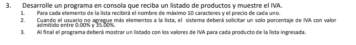

# Punto3_PruebaTecnica_Pangea

## Requisitos

## Descripcion

 El ejercicio se desarrolló en lenguaje Python para ejecutarse en la terminal. El programa muestra un menú donde el usuario puede elegir la opción 1 para escoger la función que agrega el producto y el precio a la lista de productos donde [producto, nombre] es un elemento de la lista productos, siendo esta una multilista [[producto, nombre],[producto, nombre]]. el usuario puede escoger cuándo desea agregar productos y volver al menú principal. en la opción 2 del menú el usuario accede a la función que calcula  el iva de los productos agregados, en esta función el programa solicita al usuario un número de porcentaje para calcular el iva, luego accede  a cada producto de la lista y su precio,  para luego de obtener este valor, realizar la operación (iva * precio / 100) que calcula el valor del iva de este producto, luego se sobreescribe la lista colocando como segundo elemento el valor del iva, esta lista que se muestra al usuario queda así: [[producto,valor_iva],[producto,valor_iva]].
